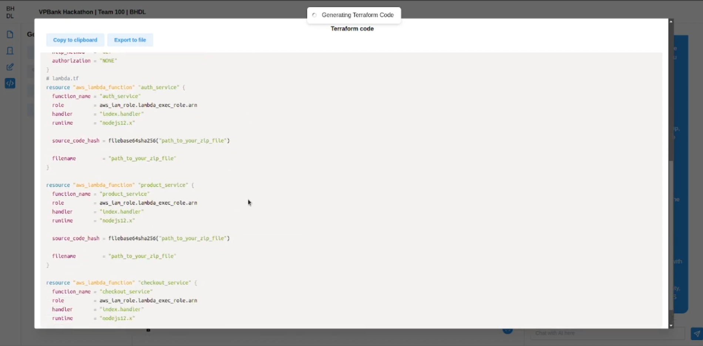

# bhdl.online backend

**bhdl.online** is an application designed to provide various functionalities to help users create and manage architecture design diagram more effectively. With the power of ChatGPT 4, out application can provide users ability to create architecture design from scratch with a more interactive and user-friendly experience. 

**Main features**

- Utilizes ChatGPT 4 to turn user's ideas into architecture design diagrams
- Ability to create, edit, explain, and manage architecture design diagrams
- Export diagram to various diagram formats (Mermaid, DrawIO)
- Generate code snippets from architecture design diagrams (Terraform, Ansible)
- Ability to handle multiple user using same diagram at the same time

# bhdl.online backend

This repository contains the backend code for the bhdl.online application. This is one of the three components of the bhdl.online project. The other two components are:
- [bhdl.online frontend](https://github.com/bhdl-ai/vpbank-hackathon-fe)
- [bhdl.online ai core](https://github.com/bhdl-ai/vpbank-hackathon-ai)

## Build with

- [Golang](https://go.dev/) : Base language to build all the algorithm and API
- [Melody](https://github.com/olahol/melody): Websocket framework to handle multiple user use same diagram at the same time
- [Tree-sitter](https://tree-sitter.github.io/tree-sitter/): Parser generator tool to parse the code snippet and generate the diagram
- [Playwright](https://playwright.dev/): Headless browser to automate the process of generating to DrawIO format (due to the limitation of DrawIO API, consider this as a workaround)

## Getting Started

### Prerequisites
- golang 1.22
- playwright with chromium browser binary
- ability to read and understand the code

To get started with the project, follow these steps:

1. Make sure you already have the [bhdl.online ai core](https://github.com/bhdl-ai/vpbank-hackathon-ai) running
2. Install the required dependencies using `go mod tidy`
3. Create your own `.env` file based on the `.env.example` file
4. If you are using linux with amd64, you can use `make run` to run the project, otherwise, you can run the project using `go run cmd/api/main.go`

Now the backend should be running on `localhost:8080`

## Owner

- [DAN3002](https://github.com/DAN3002)
- [thaiminhpv](https://github.com/thaiminhpv)
- [qwerty22121998](https://github.com/qwerty22121998)
- [khuatdev](https://github.com/khuatdev)
- [LiusDev](https://github.com/LiusDev)
